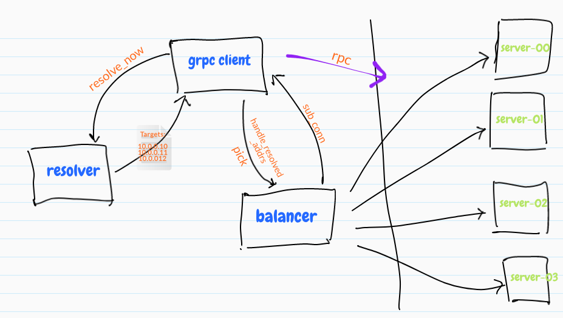

# py-grpc-lb-controller - 一个grpc的负载均衡解析器实现

## 

# 说明

关于GRPC-LB的实现，可以参考下比较基础的文章：
[GRPC服务发现&负载均衡](https://segmentfault.com/a/1190000008672912)
[gRPC Load Balancing](https://grpc.io/blog/loadbalancing/)

本项目借助于GRPC+ETCDV3实现了基础的服务注册与服务发现,借助于GRPC开放的resolver/balancer包提供的接口,实现了自定义的服务发现与负载均衡逻辑,具体实现的思路如下:

## 服务注册

## 服务发现

## 负载均衡算法

- 带权重的roundrobin & radic;

- random(随机)算法

- ketama算法

- P2C算法

## 服务访问

## 测试

## discuss

- ringbuffer@126.com